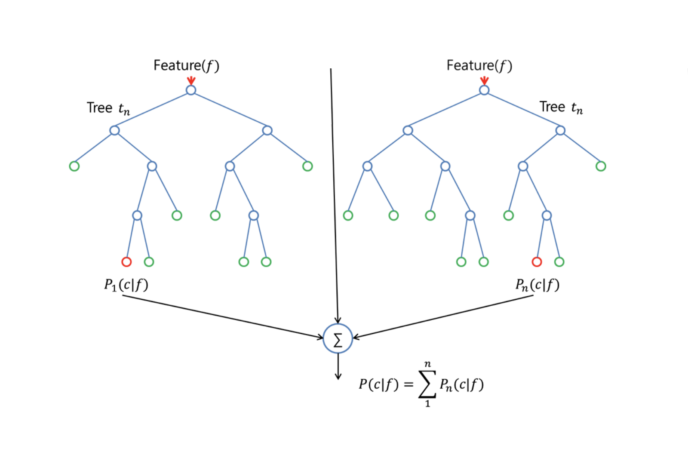
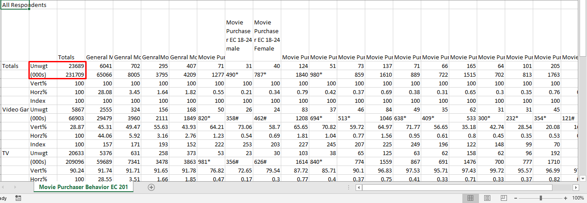
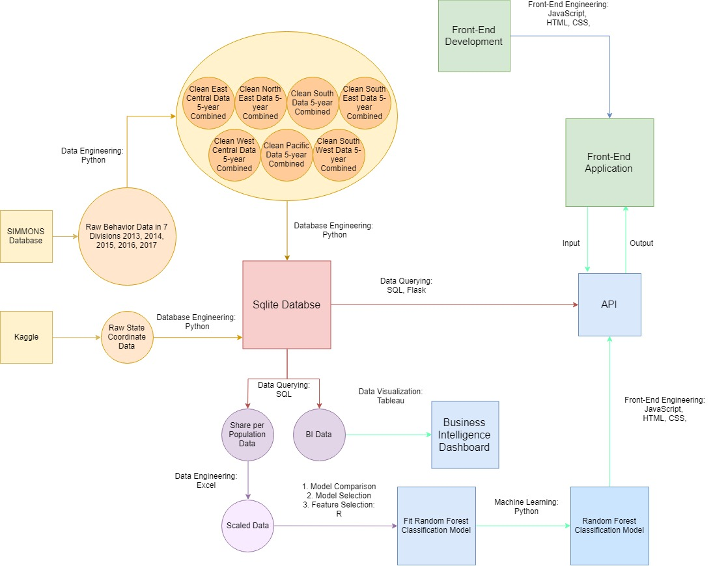
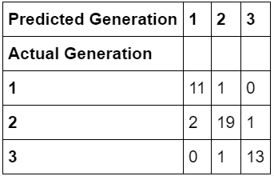
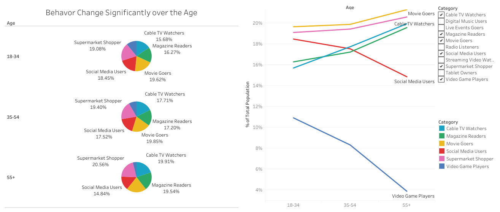
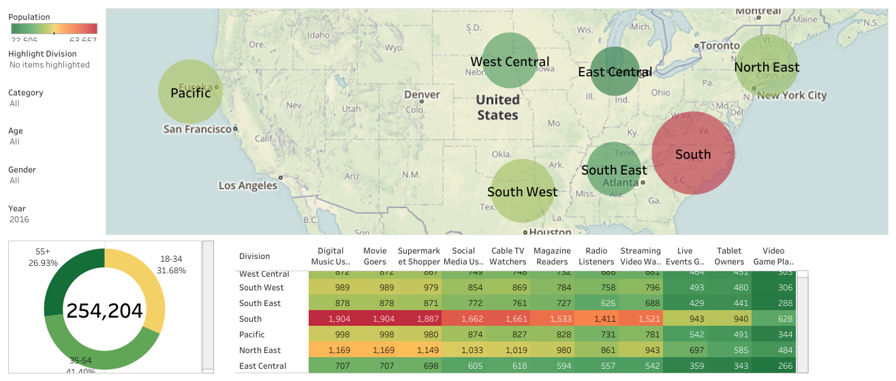
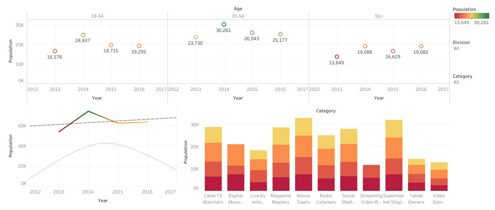

<h1 align="center">Uptrend Machine Learning Analytics Platform</h1>

<strong>Uptrend</strong> is built on top of SciKit-Learn, Flask to transform data into JSON format with API routes to support seamless RESTful data transfer for fast integration into exisiting systems or databases.
HTML/JS/CSS are used with Tableau and Mapbox to develop a full-stack front-end application for readily available data visualizations in order to make business decisions on the machine learning intelligence it provides in a highly rapid manner.

<strong>Prebuilt demo leverages Artificial Neural Networks to predict consumer behavior and vizualize in Tableau</strong>

Scroll down to see screenshots!

## Demo data highlights

* Use demographic, psychographic, attitudinal, and behavioral data to refine consumer targets and inform engagement strategies.

* Brings consumer targets to life with vivid and complete profiles, including lifestyles, attitudes, brand preferences and media use.

* Generate geographic nuances of consumers in all of America’s media markets, including purchase behavior, attitudes, lifestyles and much more.

* Develop a unique, media-neutral machine learning metric for detecting consumer trends regarding planning, buying and selling.

* Data used from Nielson, Simmons Resserach to prove Uptrend operates on data in the wild!

* [Designated Market Area](https://www.groundtruth.com/glossary_term/what-are-designated-market-areas/) regions are the geographic areas in the United States in which The Nielsen Company measures local television viewing. The DMA data are essential for any marketer, researcher, or organization seeking to utilize standardized geographic areas. The demo compares Millennials & Gen Z and other generations' consumer behaviors. Becuase Millennials and Gen Z grew up with smartphone and internet as they are aging into a new life stage as they start to get married settle down, and have families. Gen Z is aging from teenagers to young adults, and they start graduating from college and getting the first job.

## Data Outcomes

* This demo, based on a behavioral dataset of media industry from 2013 - 2016, suggests that about 85% of the customer loyalty regarding actual behavior can be predicted, in particular by demographic factors such as their generation group.

* In the modern society, everyone is trying to make more money for living, and time has become more valuable.

* Home entertainment is a more convenient and private way to attain the propose of entertaining.

#### Retailers like Amazon, Walmart, Target and Best & Buy, they are using data analysis and ML to target audiences and do dynamic advertising targeting to raise awareness and to increase sales of the products.

On social media and websites, there are many sponsored ads and banners ads, most of them are targeting consumers who have specific behaviors. We pulled data from Simmon consumer behavior database, and list eleven behavior categories for movie purchasers (purchase DVD/Blue-ray discs in past 12 months) in different generations ( Millennial, Gen X, Gen Y, Gen Z):

(1) Video Games Players

(2) Streaming Video Watchers

(3) Digital Music Users

(4) Cable TV Watchers

(5) Radio Listeners

(6) Magazine Readers

(7) Movie Goers

(8) Supermarket Shoppers

(9) Tablet Owners

(10) Live events Goers

(11) Social Media Users

**The data looks at movie purchasers’ consumer behavior for each generation, and subsequently learns each generations’ preference in each category.**

## Machine Learning Regression: Random Forest Classifier

## Random Forest Outcomes

1. **South division is the winner** regarding population, and most of the people are used to old-school media such as Movies, Supermarket, TV, Magzine, and Radio whereas younger generations apparently stick to modernized media.

   *South Division has more states include than others.*

2. **Female takes the majority** of the market share in all categories. Movies and Supermarkets are pretty much their backyards.

3. Based on our sample and model, we are now able to predict an individual's generation group with **89.6% accuracy**.

## Considerations from the machine learning outcomes to design future campaigns 

1. As the traditional "gift giving (Grandparents) " audience of the generation- Baby boomers, are the most Cable TV, consumers.

2. As the new generation purchasers: Millenials and Gen Z are the least Cable TV, consumers. However, most of them are heavy social media users.

   **Marketers and Advertisers for Home Entertainment can plan on Social Media for targeting Younger audiences.**

   *One interesting finding:* Millenials and Gen Z prefer reading Magazines than watching cable TV.

3. As the middle age generation, Gen X has the similar behaviors with Millenials, but they are lighter social media users and more massive Cable TV watchers.

4. Live- events goers, video gamers, Digital music listeners and Streaming video watchers are skewed younger.

5. Baby Boomers Social Media users are increasing.

**In general, Social Media and Digital Media are the future for Home Entertainment Campaign. Magazine and Cable TV still have loyalty and engaging audiences.**

## Data Source

**[SIMMONS](https://www.simmonsresearch.com/)**

> The Simmons / Nielsen partnership allows advertisers, agencies, and media to go beyond demographics when profiling TV audiences. By integrating viewership of Nielsen-measured national TV programs and networks with the 60,000 variables available in the Simmons National Consumer Study, clients can illustrate compelling, data-driven stories about the real value of TV audiences.

The original data set comes with 2 significant variables: Unweighted and Weighted Nielsen Sample and the reason that we choose the unweighted value is because Nielsen suggests that

> Unweighted sample analysis could be used if: 
>
> You want to recreate an analysis that was made in Audience Watch version 5.73 or earlier. You do want to see the viewing behavior of individual sample members.

**Note: US is divided into 7 divisions in terms of**

(1) North East

(2) West Central

(3) South

(4) South East

(5) South West

(6) Pacfic

(7) East Central

**Limitations due to data, not ML Capability of Uptrend:**

(1) The database **DOES NOT** contain any data in **Mountain Division**

(2) The database **DOES NOT** contain Streaming Video data from 2013 to 2014

**[Kaggle](https://www.kaggle.com/)**

> The [Coordinate Data:](https://www.kaggle.com/washimahmed/usa-latlong-for-state-abbreviations/) is USA latitude and longitude for state abbreviations retreived from Kaggle

## Uptrend Analytics Platform Pipeline from multiple data point ingestion > machine learning > output/visualization and data store:

## Above chart described:

#### Step 1： Data Retrieval
#### Obtaining data from data sources
---
#### Step 2： Data Engineering
#### Use Python to transform non-tabular formatted data into tabular data for SQL storage purpose.
---
#### Step 3： Database Engineering:
#### Design and maintain a database that provides informative and relevant data for full-stack project usage.
---
#### Step 4： Data Analytics:
#### Query SQL to analyze and interpret data sets to generate marketing insights and BI reporting.
---
#### Step 5: Data Transforming
#### Decided to utilize "% of total" of each behavior category for prediction used to classify the generation group based on the sample size. Category “Totals” refers to the sample group of our project which is the total population of **DVD movie purchasers** with given division (region), year, age and gender. Population under all other categories refer to the “Cross Region” with our study group. For example:
---
#### Step 6: Data Engineering
#### Use Python to generate the "% of total" column; Generate another column named “share” which is the proportion in **DVD purchaser** people who also choose given the category **(e.g., share = 26/31 = 0.8387)**, and there are 83.5% people from the sample group who also choose social media, who are male at age 18-24 from the east-central region. So, there are entirely some people who will choose more than one category.
---
#### Step 7: Data Engineering
#### Use the Excel pivot table for data transformation
Generate a shared table with an average share of each category between two genders each division and year.
---
#### Step 8: Feature Engineering
#### Reclassify our age group

While training and testing data in R, we figure that the only 2 generation groups, out of 5 in total, are age 18-24 and age 55+; Based upon our sample data, the algorithm could not quickly figure out the difference among age 25-34, age 35-44 and age 45-54 which make sense that these 3 groups have very similar purchasing behavior. So we replace each text age label with index, where

|                  Index                 |   Index Reference   |
|:--------------------------------------:|:-------------------:|
|          Millennials + Gen Z           |           #1        |
|            Generation   X              |           #2        |
|         Baby Boomer Generation         |           #3        |

**As the boundary in between the 3 is more apparent than before.**
---
#### Step 9: Scaling
#### Use Excel to rescale all share value into 5 levels from lowest to highest, indexing 1 through 5, for machine learning usage, and define them as Preference Levels

|                  Index                 |   Index Reference   |
|:--------------------------------------:|:-------------------:|
|                  Never                 | Preference levels 1 |
|                 Seldom                 | Preference levels 2 |
|               Occasionally             | Preference levels 3 |
|                  Often                 | Preference levels 4 |
|               Frequently               | Preference levels 5 |

---

#### Step 10: Modeling
#### Used R to make the model comparison and feature selections

There are 5 candidate ML models, and Random Forest Classifier has the highest Accuracy and Kappa, so we choose to build RF Classification Model and make a prediction in python. Moreover, according to the “Variable Importance Table,” we have tested several models with different feature selection. So, we found that below behaviors have the highest accuracy:

1. Cable TV Watchers

2. Social Media Users
3. Magazine Readers
4. Live Events Goers

5. Video Game Players
6. Tablet Owners

  

  

---

#### Step 11: Machine Learning
#### Rebuilt a Random Forest Classification Model using Python since it is more front-end friendly.

The following table was used as validation dataset, and we have calculated a scaled value array, where each one array inside represents a case in the validation dataset, and each of these three numbers in this array is used for the generation class prediction. For instance, in the first array, it shows [1., 0., 0.] which mean the model predicted that this case has 100% probability belongs to class 1, and zero probability belongs to other two classes. Moreover, then we generated a **confusion matrix**, and numbers on the diagonal means it was corrected predicted, and numbers on all other position mean it was not correctly predicted. So **the accuracy rate = (11 + 19 + 13)/(11 + 2 + 1 + 19 + 1 + 1 + 13) = 89.6%**.

> A confusion matrix is a table that is often used to describe the performance of a classification model (or "classifier") on a set of test data for which the valid values are known

 

  

---

#### Step 12: API Development

Transform data into JSON format and deploy into API to support front-end applications.

---

#### Step 13: Data Visualization

Use HTML/JS/CSS corporate with Tableau and Mapbox to develop a full-stack front-end application.

---

## Output/Screenshots from Tableau

## Technology Used

Scikit-learn

> Scikit-learn is a free software machine learning library for the Python programming language. It features various classification, regression and clustering algorithms including support vector machines, random forests, gradient boosting, k-means and DBSCAN, and is designed to interoperate with the Python numerical and scientific libraries NumPy and SciPy.

Python

> Python is an interpreted high-level programming language for general-purpose programming. Created by Guido van Rossum and first released in 1991, Python has a design philosophy that emphasizes code readability, notably using significant whitespace. It provides constructs that enable clear programming on both small and large scales

SQLite

> SQLite is a self-contained, high-reliability, embedded, full-featured, public-domain, SQL database engine. SQLite is the most used database engine in the world.

HTML / CSS / JavaScript

> HTML provides the basic structure of sites, which is enhanced and modified by other technologies like CSS and JavaScript. CSS is used to control presentation, formatting, and layout. JavaScript is used to control the behavior of different elements.

Tableau

> Tableau can help anyone see and understand their data. Connect to almost any database, drag and drop to create visualizations, and share with a click.

Flask

> Flask is a microframework for Python based on Werkzeug, Jinja 2 and good intentions.

### Need Implementation help?

If ML/AI is important to you or your business, so you can make faster, more accurate decisions with Machine Learning? Please get in touch with [Jay Weinberg](https://www.linkedin.com/in/jay-weinberg-94b233/), as The Jay Group does professional machine learning integration with Uptrend Open Source ML Platform.

### Contact

Email: jay@thejaygroup.com

